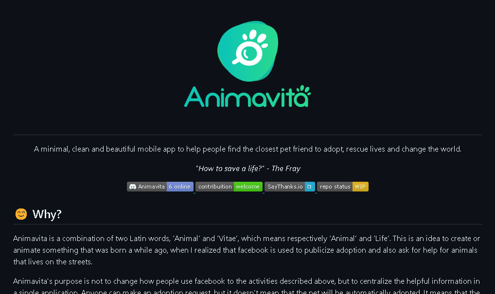

# Projeto com README
um projeto de teste com arquivo readme 🚀

[]

## Tecnoligias utilizadas
- HTML
- CSS
- JS
## Como utilizar

1 - Clone o projeto 
```
git clone <url>
```

2 - Acesse a pasta do projeto
```
cd repositorio-com-readme
```